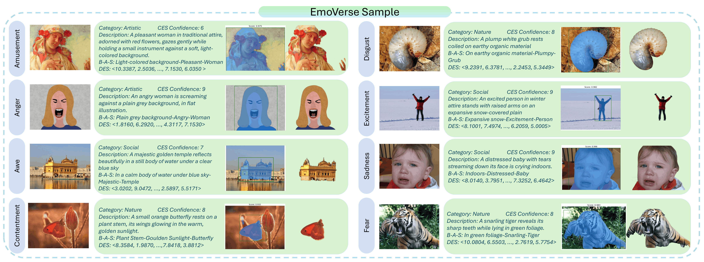
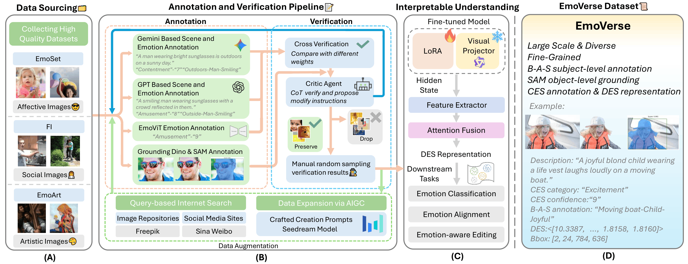

# EmoVerse: A MLLMs-Driven Emotion Representation Dataset for Interpretable Visual Emotion Analysis 🌌

[](https://arxiv.org/abs/2511.12554)
[](https://alkaline-acid.github.io/EmoVerse/)
[](LICENSE)

Official repository for **EmoVerse**, a large-scale visual emotion dataset designed for interpretable visual emotion analysis.

EmoVerse connects categorical emotion labels, continuous dimensional emotion representations, text-level emotional attribution, and grounded visual evidence. The goal is simple: help models understand not just **what** emotion an image evokes, but **why**. ✨

<p align="center">
  
</p>

> Release status: code, training utilities, inference helpers, and model release notes are now included. Dataset files and large checkpoint weights are not stored in this Git repository.

## News

- 2026-05-16: Added arXiv link and refreshed the project homepage.
- 2026-05-16: Public repository skeleton created.

## Links

| Resource | Status |
| --- | --- |
| Project page | [GitHub Pages](https://alkaline-acid.github.io/EmoVerse/) |
| Paper | [arXiv:2511.12554](https://arxiv.org/abs/2511.12554) |
| Code and loaders | Included in `src/`, `training/`, and `inference/` |
| Model checkpoints | [Hugging Face](https://huggingface.co/alkalol/EmoVerse-LoRA) |

## Dataset at a Glance

| Item | EmoVerse |
| --- | --- |
| Scale | 219K+ images in the arXiv preprint |
| Emotion categories | Mikels-style 8-class Categorical Emotion States (CES) |
| Continuous representation | 1024-dimensional Dimensional Emotion Space (DES) |
| Interpretability | Background-Attribute-Subject (B-A-S) triplets |
| Grounding | Subject-level boxes and masks generated with Grounding DINO and SAM |
| Image sources | Social, artistic, affective, collected, and generated images |
| Main tasks | Emotion classification, emotion explanation, emotion-aware generation, emotion alignment, data augmentation |

## Why EmoVerse

Most visual emotion datasets annotate an image with one global label. EmoVerse aims to make emotion annotation explainable by recording:

- **what** emotion is perceived,
- **how strongly** it is expressed,
- **which visual subject** contributes to it,
- **which scene and attribute** explain the response,
- and **where** the relevant visual evidence is located.

This structure supports both recognition and generation tasks, while making it easier to inspect why a model predicts a specific emotion. Think of it as an emotion map for images: category, intensity, explanation, and pixels all in one place. 🧭

## Framework

<p align="center">
  
</p>

## Annotation Schema

Each sample is represented with a compact emotion reasoning record:

```json
{
  "id": "Amusement000001",
  "image_path": "images/amusement/Amusement000001.jpg",
  "description": "A group of people enjoy a leisurely stroll on a sun-dappled park path.",
  "emotion": "Amusement",
  "confidence": 5.0,
  "background": "A sun-dappled park path lined with tall trees",
  "attribute": "Leisurely",
  "subject": "People",
  "B-A-S": "A sun-dappled park path-Leisurely-People",
  "DES": [10.3387, 2.5036, "..."],
  "bbox": [
    {"x1": 156.0, "y1": 283.0, "x2": 296.0, "y2": 678.0}
  ],
  "mask_path": null
}
```

`DES` is a 1024-dimensional vector. The example above is truncated for readability.

The final public schema may include additional fields for split metadata, source provenance, validation status, and mask assets.

## Code and Models

This release includes:

- `src/emoverse_model/`: EmoVerse-specific LoRA and emotion-head training utilities.
- `training/qwenvl/`: Qwen-VL fine-tuning modules used by the experiments.
- `training/scripts/`: launch scripts and DeepSpeed configs.
- `inference/`: inference and scoring helpers.
- `examples/`: compact data-format examples.
- `MODEL_RELEASE.md`: notes for the lightweight PEFT LoRA and full-model checkpoint release.

See [MODEL_RELEASE.md](MODEL_RELEASE.md) for checkpoint details and notes about the larger full-model export.
The public LoRA adapter is available on [Hugging Face](https://huggingface.co/alkalol/EmoVerse-LoRA).

## Repository Layout

```text
.
├── README.md
├── DATA_ACCESS.md
├── DATASET_CARD.md
├── CITATION.cff
├── LICENSE
├── docs/
│   ├── index.html
│   ├── styles.css
│   └── .nojekyll
└── scripts/
    └── check_release.ps1
```

Large local files, raw datasets, archives, PDFs, spreadsheets, model weights, and experiment outputs are ignored by default.

Current release additions:

```text
src/emoverse_model/
training/qwenvl/
training/scripts/
inference/
examples/
```

## Data Access

The dataset is not committed to this repository. Please see [DATA_ACCESS.md](DATA_ACCESS.md) for the planned release policy and local file safeguards.

## Citation

If EmoVerse is useful for your research, please cite:

```bibtex
@article{guo2025emoverse,
  title={EmoVerse: A MLLMs-Driven Emotion Representation Dataset for Interpretable Visual Emotion Analysis},
  author={Guo, Yijie and Hong, Dexiang and Chen, Weidong and She, Zihan and Ye, Cheng and Chang, Xiaojun and Mao, Zhendong},
  journal={arXiv preprint arXiv:2511.12554},
  year={2025}
}

```

The BibTeX entry will be updated if the venue version changes.

## License

Code and repository text are released under the MIT License. Dataset terms will be published separately before public data access is enabled.
